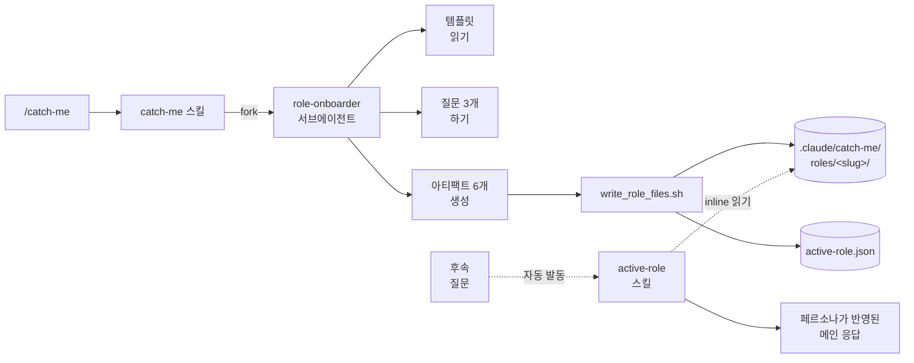

<div align="center">

# catch-me-if-you-can

**어떤 직군이든 — 한 턴 만에 현업처럼.**
사기꾼의 속성 크래시코스를 프로젝트에 심어서, 초보 관광객이 아니라 현업자처럼 Claude를 부리게 해주는 Claude Code 플러그인.

[](https://github.com/junjunjunbong/catch-me-if-you-can/releases)
[](LICENSE)
[](https://docs.claude.com/en/docs/claude-code)
[](#왜-프로젝트-로컬인가)

[English](README.md) | **한국어**

</div>

---

## 컨셉

Frank Abagnale은 의대를 다닌 적이 없다. 분위기를 읽고, shibboleth(신호어)를 익히고, 의심이 사라질 때까지 의사처럼 행동했을 뿐이다. 이 플러그인이 그걸 해준다.

`/catch-me` 실행 → 역할을 자연어로 말함 → 그 직군의 언어, 의견, 안티패턴, 첫 주 액션을 담은 아티팩트 6개가 생성된다. 이후 `active-role` 스킬이 그 관점을 Claude Code 세션에 조용히 얹어줘서, 프로젝트 질문에 실제로 그 일을 해본 사람의 답변이 돌아온다.

> **교과서가 아니다.** 모든 문장은 (a) shibboleth를 가르치거나, (b) 의견을 심거나, (c) 초보 티 (tourist-tell)를 막거나, (d) 액션을 촉발해야 한다. Wikipedia 스타일 개요는 잘라낸다.

## 데모

```text
$ /catch-me

» Which profession do you want to pass as? Role + flavor.
you> game developer — indie Unity 2D, solo

» How deep? (a) dinner-party  (b) week-one [default]  (c) month-one
you> week-one

» What are you working on in this project right now?
you> puzzle-platformer prototype, pixel art, testing mechanics

Activated: Indie Unity 2D Game Developer  (depth: week-one)

Top 5 lexicon terms you'll hear:
  • frame budget — 16.67ms per frame at 60fps
  • coroutines — Unity's preferred async primitive
  • addressables — Unity's asset loading system
  • ScriptableObject — data container decoupled from MonoBehaviour
  • dirty flag — "this changed, redraw/recompute"

3 opinions a real one always has:
  1. 2D Pixel Perfect package over DIY camera math — required, not nice-to-have
  2. URP yes, HDRP no — HDRP is wasted on 2D indie scope
  3. DOTS is not for you yet — stick with MonoBehaviour until proven bottleneck

First thing to do in this project:
  Open the profiler, screenshot GC allocations during gameplay.
  Anything above 0 per frame is your first fix target.

Files saved to .claude/catch-me/roles/game-dev-indie-unity-2d/
```

이후엔 이 프로젝트에서 어떤 질문(`"첫 스프린트 어떻게 나눌까?"`)을 하든, 활성화된 페르소나 관점으로 답변이 돌아온다 — 자동으로.

> 참고: 생성되는 아티팩트는 v1 한정으로 영어로 나온다. 추후 한국어 지원은 로드맵에 있다.

## 생성되는 파일

역할 하나당 6개 파일, `.claude/catch-me/roles/<slug>/`에 저장된다:

| 파일 | 담는 내용 |
|---|---|
| `persona.md` | 이 역할의 목소리, 기본값, 무엇을 반박하고 무엇을 절대 제안하지 않는지 |
| `lexicon.md` | shibboleth 40–60개 — 각각 실제 사용 예문과, 초보 티(tourist-tell) 되는 오용 포함 |
| `signaling.md` | 현업이 항상 가지는 의견 3개, 선호 도구, 커뮤니티가 비웃는 것 |
| `anti-patterns.md` | 즉시 들통나는 행동, Claude에게 절대 시키지 말 것, 바꿔야 할 표현 |
| `monday.md` | 5일간의 구체 액션 플랜 — 실행 커맨드, 열어볼 파일, 말 걸 사람, 내릴 결정 |
| `project-playbook.md` | *지금 이 프로젝트*에 맞춘 의사결정 규칙 |

추가로 slug, depth, 생성 시각이 담긴 `meta.json`.

## 설치

Claude Code에서 마켓플레이스 추가:

```
/plugin marketplace add junjunjunbong/catch-me-if-you-can
```

플러그인 설치:

```
/plugin install catch-me-if-you-can@junjunjunbong
```

플러그인 리로드:

```
/reload-plugins
```

## 사용법

아무 프로젝트에서 Claude Code를 열고 실행:

```
/catch-me
```

힌트를 바로 넘기면 첫 질문은 스킵된다:

```
/catch-me game developer — indie Unity 2D
/catch-me "data engineering for batch pipelines"
/catch-me PM B2B SaaS early-stage
```

### Depth 레벨

| Depth | 언제 고를지 |
|---|---|
| `dinner-party` | 10분짜리 대화를 버티면 된다 |
| `week-one` | 월요일에 출근해서 첫 주를 넘겨야 한다 *(기본값)* |
| `month-one` | 한 달 안에 작은 의사결정을 해야 한다 |

Depth가 높을수록 `monday.md`가 두꺼워지고, `project-playbook.md`가 풍부해지고, `persona.md`가 더 단호해진다.

## 작동 방식



- `/catch-me`는 프로젝트 스킬이고, `role-onboarder` 서브에이전트를 fork로 위임한다.
- 서브에이전트는 질문 최대 3개 → `${CLAUDE_PLUGIN_ROOT}`에서 생성 템플릿 읽기 → 6개 블록 출력 → 저장 스크립트로 파이프.
- `active-role`은 숨겨진 자동 발동 스킬이다. 역할 관련 후속 질문에서만 활성 페르소나를 읽어 메인 응답에 녹여낸다 — "제가 게임 개발자로서…" 같은 연극 대사는 없다.

## 왜 프로젝트 로컬인가

플러그인 자체는 (한 번만) 전역 설치되지만, 플러그인이 생성하는 모든 역할 데이터는 `/catch-me`를 실행한 **그 프로젝트**의 `.claude/catch-me/` 아래에 저장된다.

| 고민 | 설계 |
|---|---|
| 여러 프로젝트를 오가며 작업 | 각 프로젝트가 자기만의 활성 역할을 가진다 — 섞이지 않음 |
| *이 코드베이스*에 딱 맞는 역할이 필요 | `project-playbook.md`가 실제로 말해준 프로젝트 맥락을 참조 |
| 역할을 여러 프로젝트에서 공유 | v1에선 없음 — Phase 3의 `/catch-me-export`로 예정 |
| 데이터가 기기 밖으로 나가는지 | 어디에도 안 보낸다. 생성은 Claude Code 세션 안에서 일어나고, 아티팩트는 디스크에 남는다 |

## 설계 원칙

- **사기꾼이지 교과서가 아니다.** 어떤 기술 직군에도 맞는 문장은 삭제한다. 구체성이 전부다.
- **수동적 페르소나.** 역할 관련 질문일 때 `active-role`이 관점을 얹는다. "제가 게임 개발자로서…" 같은 preamble 없음. CLAUDE.md 자동 삽입 없음. SessionStart 훅 없음.
- **1단계 위임.** `/catch-me` → 서브에이전트 → 끝. 중첩된 서브에이전트 체인이나 스킬 재진입 없음.
- **프로젝트 로컬 state.** 플러그인은 전역 설치되지만, 모든 아티팩트는 사용자 프로젝트 안에 머문다.

## 상태

`v0.1.0` — Phase 1 출시 완료.

| 단계 | 범위 |
|---|---|
| **Phase 1** ✓ | `/catch-me`, `active-role`, 아티팩트 풀 생성 |
| **Phase 2** | `/catch-switch`, `/catch-list`, `/catch-forget` |
| **Phase 3** | `/catch-deepen`, `/catch-quiz`, 역할 export |
| **v1.1** | 자동 발동이 불안정하면 `UserPromptSubmit` 훅 보강 |

## 레포 구조

```
catch-me-if-you-can/
├── .claude-plugin/
│   ├── plugin.json                          # 플러그인 매니페스트
│   └── marketplace.json                     # GitHub 호스팅 마켓플레이스
├── skills/
│   ├── catch-me/
│   │   ├── SKILL.md                         # /catch-me 진입점 (fork → role-onboarder)
│   │   ├── templates/
│   │   │   └── role-generation-prompt.md    # 품질 레버
│   │   └── scripts/
│   │       └── write_role_files.sh          # 아티팩트 원자적 저장
│   └── active-role/
│       └── SKILL.md                         # 숨겨진 자동 발동 페르소나 로더
├── agents/
│   └── role-onboarder.md                    # 온보딩 + 생성 서브에이전트
├── README.md
├── README.ko.md
└── LICENSE
```

번들 파일은 런타임에 `${CLAUDE_PLUGIN_ROOT}`로 참조된다. State 쓰기는 항상 `$(pwd)/.claude/catch-me/`로 간다.

## 기여

이 플러그인에서 가장 레버리지 큰 파일은 [`skills/catch-me/templates/role-generation-prompt.md`](skills/catch-me/templates/role-generation-prompt.md)다 — 출력이 교과서처럼 읽힐지, 현업이 말하는 것처럼 읽힐지를 결정하는 파일. 이 템플릿을 날카롭게 다듬는 PR(새 섹션 규칙, 더 강한 anti-generic 가드, 더 나은 depth 보정)이 가장 환영받는 기여다.

그 다음 가치 있는 건 `role-onboarder` 서브에이전트의 에러 처리 확장과 Phase 2 커맨드 구현.

아키텍처 변경을 제안한다면 이슈부터 열어줘 — 프로젝트 로컬 state, 1단계 위임, 수동적 페르소나 같은 제약들은 이유가 있어서 그렇게 만들어진 것이다.

## 라이선스

[MIT](LICENSE) © 2026 junjunjunbong
