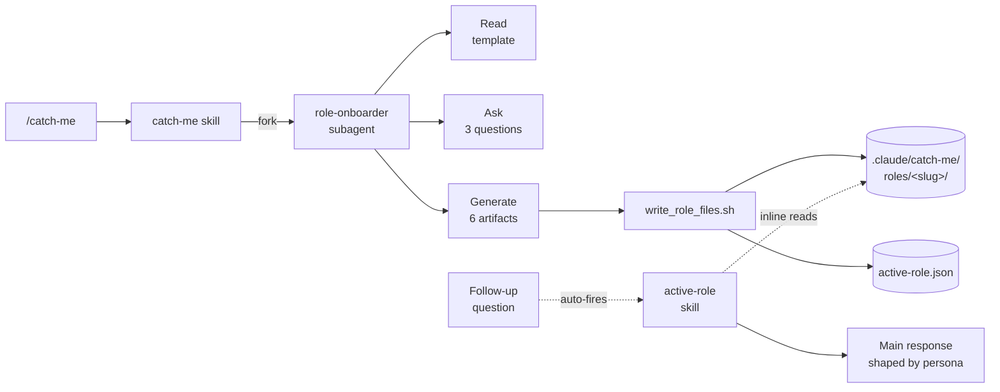

<div align="center">

# catch-me-if-you-can

**Pass as any profession — in one turn.**
A Claude Code plugin that drops a con-artist's crash course into your project so you can direct Claude like a practitioner, not a tourist.

[](https://github.com/junjunjunbong/catch-me-if-you-can/releases)
[](LICENSE)
[](https://docs.claude.com/en/docs/claude-code)
[](#why-project-local)

</div>

---

## The pitch

Frank Abagnale didn't attend medical school — he read the room, learned the shibboleths, and acted like a doctor until people stopped questioning him. This plugin does that for you.

Run `/catch-me`, name the role, and get back six artifacts that teach you the language, opinions, anti-patterns, and first-week actions of a real practitioner. The `active-role` skill then quietly folds that lens into the rest of your Claude Code session — so when you ask about your project, you get answers shaped by someone who's actually done the job.

> **Not a textbook.** Every sentence is built to (a) teach a shibboleth, (b) install an opinion, (c) prevent a tell, or (d) trigger an action. Wikipedia-style overviews get cut.

## Demo

```text
$ /catch-me

» Which profession do you want to pass as? Role + flavor.
you> game developer — indie Unity 2D, solo

» How deep? (a) dinner-party  (b) week-one [default]  (c) month-one
you> week-one

» What are you working on in this project right now?
you> puzzle-platformer prototype, pixel art, testing mechanics

Activated: Indie Unity 2D Game Developer  (depth: week-one)

Top 5 lexicon terms you'll hear:
  • frame budget — 16.67ms per frame at 60fps
  • coroutines — Unity's preferred async primitive
  • addressables — Unity's asset loading system
  • ScriptableObject — data container decoupled from MonoBehaviour
  • dirty flag — "this changed, redraw/recompute"

3 opinions a real one always has:
  1. 2D Pixel Perfect package over DIY camera math — required, not nice-to-have
  2. URP yes, HDRP no — HDRP is wasted on 2D indie scope
  3. DOTS is not for you yet — stick with MonoBehaviour until proven bottleneck

First thing to do in this project:
  Open the profiler, screenshot GC allocations during gameplay.
  Anything above 0 per frame is your first fix target.

Files saved to .claude/catch-me/roles/game-dev-indie-unity-2d/
```

From here, any domain-relevant question you ask (`"how should I split the first sprint?"`) gets answered through the active persona — automatically.

## What gets generated

Six files per role, saved under `.claude/catch-me/roles/<slug>/`:

| File | What it holds |
|---|---|
| `persona.md` | Voice, defaults, what this role challenges, what they never suggest |
| `lexicon.md` | 40–60 shibboleths — each with realistic usage and the common misuse that outs a fake |
| `signaling.md` | 3 opinions a real one always has, tool preferences, what the community laughs at |
| `anti-patterns.md` | Instant tells, prompts that out you, phrases to swap |
| `monday.md` | 5-day concrete action plan — commands, files, people, decisions |
| `project-playbook.md` | Decision rules tied to *your specific project* |

Plus a `meta.json` with slug, depth, generation timestamp.

## Install

Add the marketplace in Claude Code:

```
/plugin marketplace add junjunjunbong/catch-me-if-you-can
```

Install the plugin:

```
/plugin install catch-me-if-you-can@junjunjunbong
```

Reload plugins:

```
/reload-plugins
```

## Usage

Open any project in Claude Code and run:

```
/catch-me
```

Or pass a hint to skip the first question:

```
/catch-me game developer — indie Unity 2D
/catch-me "data engineering for batch pipelines"
/catch-me PM B2B SaaS early-stage
```

### Depth levels

| Depth | When to pick it |
|---|---|
| `dinner-party` | You need to hold a 10-minute conversation |
| `week-one` | You're starting Monday and need to survive the first week *(default)* |
| `month-one` | You'll make a small decision inside a month |

Higher depth → thicker `monday.md`, richer `project-playbook.md`, more opinionated `persona.md`.

## How it works



- `/catch-me` is a project skill that forks a `role-onboarder` subagent.
- The subagent asks up to 3 questions, reads the generation template from `${CLAUDE_PLUGIN_ROOT}`, emits six delimited blocks, and pipes them through a save script.
- `active-role` is a hidden, auto-invoked skill. On any role-relevant follow-up, it reads the active persona and quietly threads it into the main response — no role-play preamble.

## Why project-local?

The plugin is installed globally (once), but every role it generates is saved inside the project you run it in, at `.claude/catch-me/`.

| Concern | Design |
|---|---|
| Working in multiple projects | Each project keeps its own active role — no bleed-through |
| A role tailored to *this* codebase | `project-playbook.md` references the actual project you described |
| Sharing a role across projects | Not v1 — planned as `/catch-me-export` in Phase 3 |
| Data leaving your machine | Nothing is sent anywhere. Generation happens in your Claude Code session, and artifacts stay on disk |

## Design principles

- **Con artist, not textbook.** If a sentence is true for any technical role, delete it. Specificity is the whole product.
- **Passive persona.** `active-role` loads the lens when relevant. No `"As a game developer, I would..."` preamble. No CLAUDE.md auto-injection. No SessionStart hooks.
- **One-level delegation.** `/catch-me` → subagent → done. No nested subagent chains or skill re-entry.
- **Project-local state.** The plugin ships globally, but every artifact lives inside the user's project.

## Status

`v0.1.0` — Phase 1 shipped.

| Phase | Scope |
|---|---|
| **Phase 1** ✓ | `/catch-me`, `active-role`, full artifact generation |
| **Phase 2** | `/catch-switch`, `/catch-list`, `/catch-forget` |
| **Phase 3** | `/catch-deepen`, `/catch-quiz`, role export |
| **v1.1** | Optional `UserPromptSubmit` hook if auto-invocation proves flaky |

## Repo layout

```
catch-me-if-you-can/
├── .claude-plugin/
│   ├── plugin.json                          # Plugin manifest
│   └── marketplace.json                     # GitHub-hosted marketplace
├── skills/
│   ├── catch-me/
│   │   ├── SKILL.md                         # /catch-me entry (forks → role-onboarder)
│   │   ├── templates/
│   │   │   └── role-generation-prompt.md    # The quality lever
│   │   └── scripts/
│   │       └── write_role_files.sh          # Atomic artifact writer
│   └── active-role/
│       └── SKILL.md                         # Hidden auto persona loader
├── agents/
│   └── role-onboarder.md                    # Onboarding + generation subagent
├── README.md
└── LICENSE
```

Bundled files are referenced at runtime via `${CLAUDE_PLUGIN_ROOT}`. State writes always go to `$(pwd)/.claude/catch-me/`.

## Contributing

The highest-leverage file in this plugin is [`skills/catch-me/templates/role-generation-prompt.md`](skills/catch-me/templates/role-generation-prompt.md) — it decides whether the output reads like a textbook or like a real practitioner talking. PRs that sharpen that template (new section rules, stronger anti-generic guards, better depth calibration) are the most welcome contribution.

Second-tier: expanding the `role-onboarder` subagent's error handling, and implementing the Phase 2 commands.

Open an issue first if you're proposing architectural changes — there are some deliberate constraints (project-local state, one-level delegation, passive persona) that exist for reasons documented in the plan.

## License

[MIT](LICENSE) © 2026 junjunjunbong
